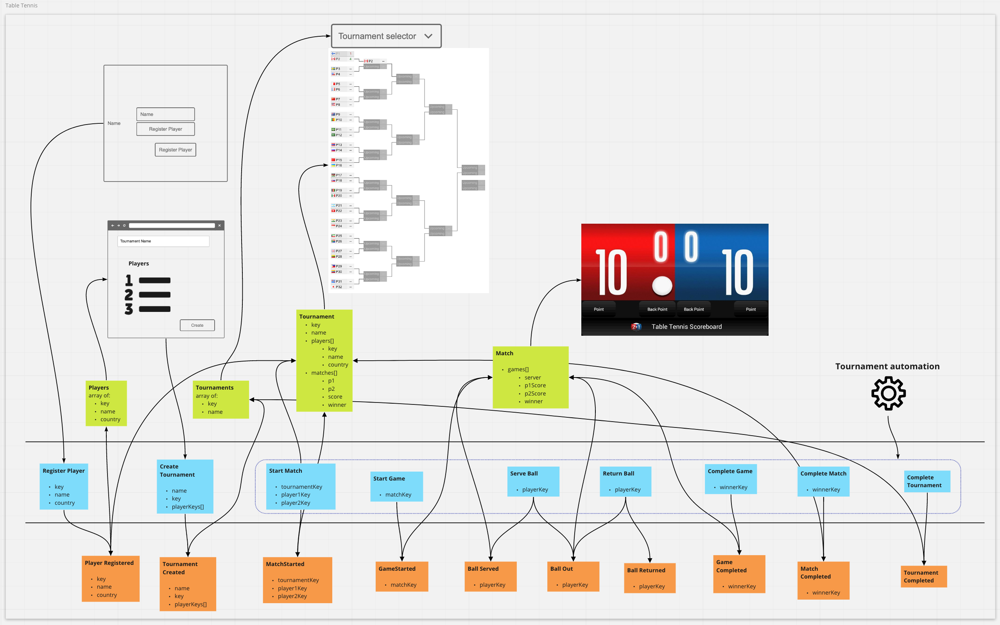

# graphql-workshop

GraphQL / Event Modeling workshop project.

## Installation

* Install NodeJS 12 or greater: https://nodejs.org
* Install JS modules:
```sh
npm install
```
* Install Docker 2.5 or greater: https://docker.com/products/docker-desktop
* Installl Event Store 5.0.8 (specifically) via docker command:

```sh
docker run --name eventstore-workshop -it -p 2113:2113 -p 1113:1113 eventstore/eventstore:5.0.8-xenial -e EVENT-STORE_DEV=true -e EVENTSTORE_RUN_PROJECTIONS=All -e EVENTSTORE_START_STANDARD_PROJECTIONS=true
```

### Projections

Add projections to EventStore:

```sh
node src/get-event-store/projections/install.js
```

Enable Projections in Event Store Admin:

* Go to http://localhost:2113/
* Log in
  * user: admin
  * pass: changeit
* Go to Projections tab; you should see table tennis projections installed.
* Click [Enable All] button.

### GraphQL

Launch Apollo:

```sh
npm run launch-apollo
```

* Go to http://localhost:4000 which is the Playground app.

Create a player with a mutation command:

```graphql
mutation {
  registerPlayer(name: "Your Name Here", country: "CA")
}
```

In a new Tab, Create a players query:

```graphql
{
  players {
    name
    country
  }
}
```

You should see your name in this list. Congratulations, you have succeeded at setting up Event Store and Apollo GraphQL!

## Table Tennis Event Model

